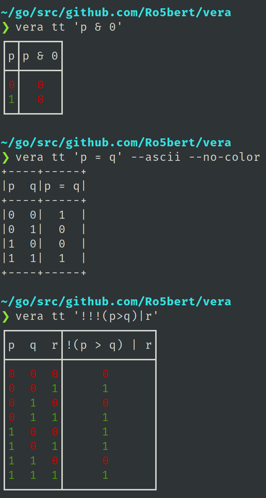

# vera

### Installation
`go get https://github.com/Ro5bert/vera`

The CLI binary can be built from the `cli` folder; for example:
```
cd $(go env GOPATH)/src/github.com/Ro5bert/vera/cli && go build -o vera main.go
```

### Syntax

<table>
<tr> <td><code>0</code></td> <td>False</td> </tr>
<tr> <td><code>1</code></td> <td>True</td> </tr>
<tr> <td><code>a</code>-<code>z</code>, <code>A</code>-<code>Z</code></td> <td>Statement</td> </tr>
<tr> <td><code>(...)</code></td> <td>Grouping/explicit binary operator precedence</td> </tr>
<tr> <td><code>!</code></td> <td>Negate</td> </tr>
<tr> <td><code>&</code></td> <td>AND</td> </tr>
<tr> <td><code>|</code></td> <td>OR</td> </tr>
<tr> <td><code>^</code></td> <td>XOR</td> </tr>
<tr> <td><code>&gt;</code></td> <td>Conditional/Implication</td> </tr>
<tr> <td><code>=</code></td> <td>Bi-conditional/Equality/IFF</td> </tr>
</table>

### Limitations

- There is a maximum of 52 atomic statements (26 lowercase letters + 26 uppercase letter = 52). (Although, I am not sure
  why or how you would have 52 atomic statements... performance is O(2<sup>n</sup>) where n is number of atomic statements).
- To avoid subjectivity in operator precedence, all binary operators are assigned equal precedence and must be
  parenthesized as necessary (even if the operators are all AND, for example); this may change in the future.
  (Negation, of course, still has higher precedence than all binary operators.)
  
### Sample CLI Output

<!--<pre>
$ vera tt 'p & 0'
┌─┬─────┐
│p│p &amp; 0│
├─┼─────┤
│<font style="color:#CC0000">0</font>│<font style="color:#CC0000">  0  </font>│
│<font style="color:#4E9A06">1</font>│<font style="color:#CC0000">  0  </font>│
└─┴─────┘

$ vera tt 'a&b'
┌────┬─────┐
│a  b│a &amp; b│
├────┼─────┤
│<font style="color:#CC0000">0</font>  <font style="color:#CC0000">0</font>│<font style="color:#CC0000">  0  </font>│
│<font style="color:#CC0000">0</font>  <font style="color:#4E9A06">1</font>│<font style="color:#CC0000">  0  </font>│
│<font style="color:#4E9A06">1</font>  <font style="color:#CC0000">0</font>│<font style="color:#CC0000">  0  </font>│
│<font style="color:#4E9A06">1</font>  <font style="color:#4E9A06">1</font>│<font style="color:#4E9A06">  1  </font>│
└────┴─────┘

$ # Notice superfluous negations are removed and whitespace is added.
$ vera tt '!!!(p>q)|r'
┌───────┬────────────┐
│p  q  r│!(p &gt; q) | r│
├───────┼────────────┤
│<font style="color:#CC0000">0</font>  <font style="color:#CC0000">0</font>  <font style="color:#CC0000">0</font>│<font style="color:#CC0000">     0      </font>│
│<font style="color:#CC0000">0</font>  <font style="color:#CC0000">0</font>  <font style="color:#4E9A06">1</font>│<font style="color:#4E9A06">     1      </font>│
│<font style="color:#CC0000">0</font>  <font style="color:#4E9A06">1</font>  <font style="color:#CC0000">0</font>│<font style="color:#CC0000">     0      </font>│
│<font style="color:#CC0000">0</font>  <font style="color:#4E9A06">1</font>  <font style="color:#4E9A06">1</font>│<font style="color:#4E9A06">     1      </font>│
│<font style="color:#4E9A06">1</font>  <font style="color:#CC0000">0</font>  <font style="color:#CC0000">0</font>│<font style="color:#4E9A06">     1      </font>│
│<font style="color:#4E9A06">1</font>  <font style="color:#CC0000">0</font>  <font style="color:#4E9A06">1</font>│<font style="color:#4E9A06">     1      </font>│
│<font style="color:#4E9A06">1</font>  <font style="color:#4E9A06">1</font>  <font style="color:#CC0000">0</font>│<font style="color:#CC0000">     0      </font>│
│<font style="color:#4E9A06">1</font>  <font style="color:#4E9A06">1</font>  <font style="color:#4E9A06">1</font>│<font style="color:#4E9A06">     1      </font>│
└───────┴────────────┘
</pre>-->


